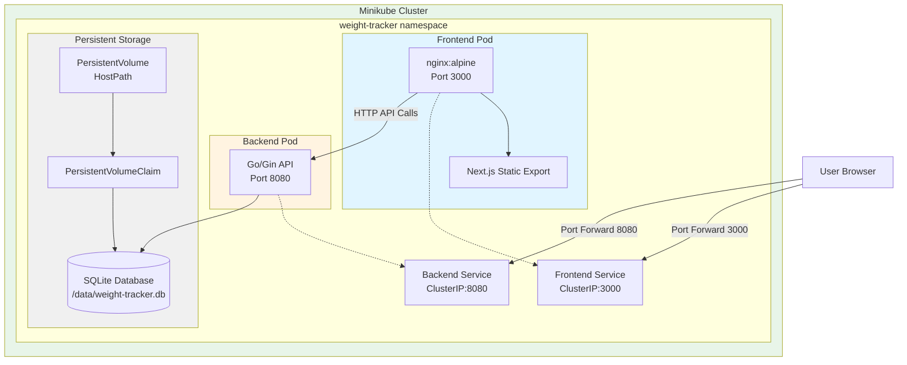
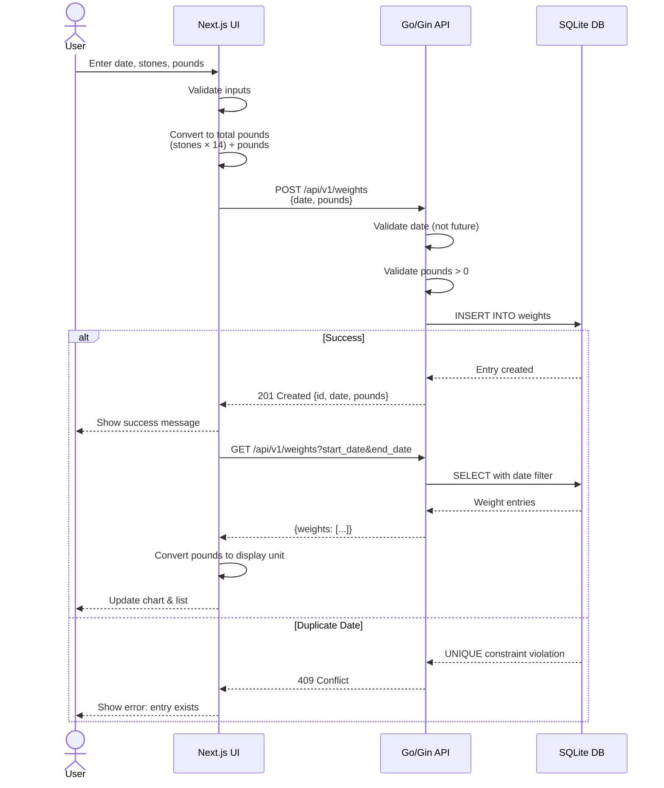
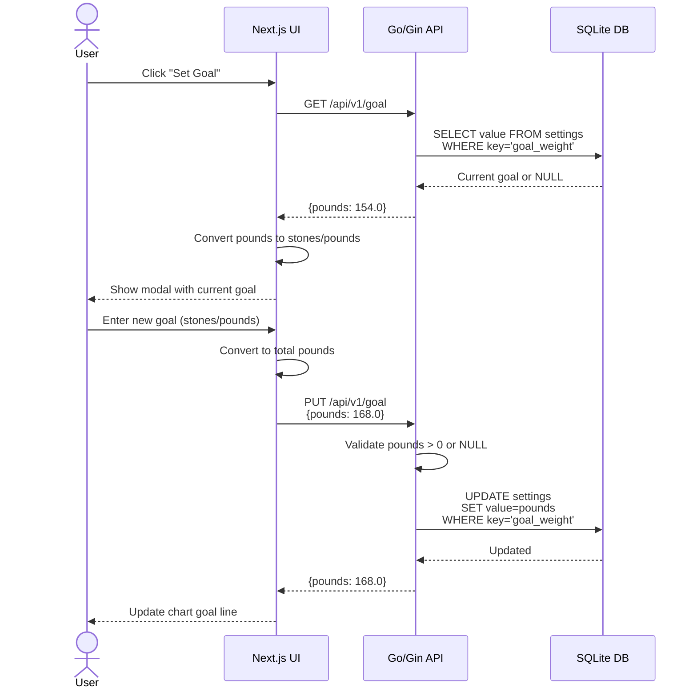
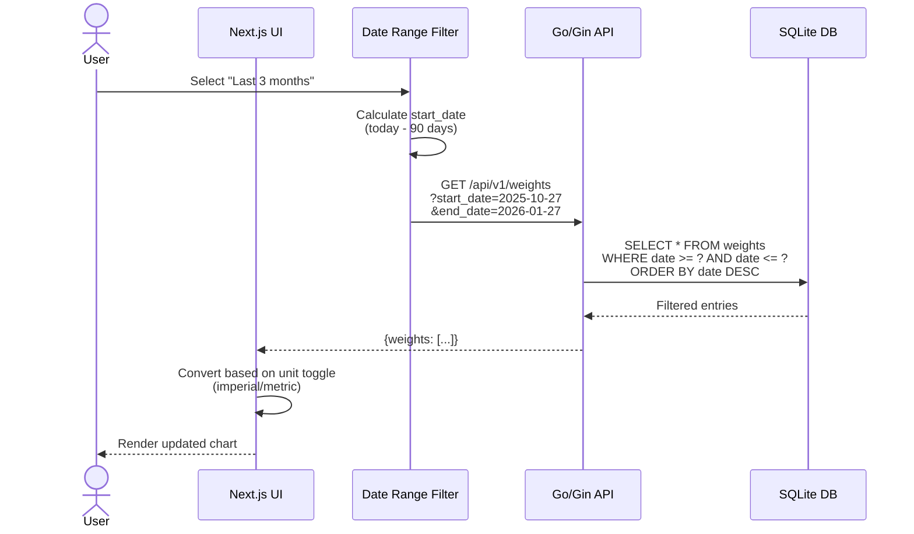
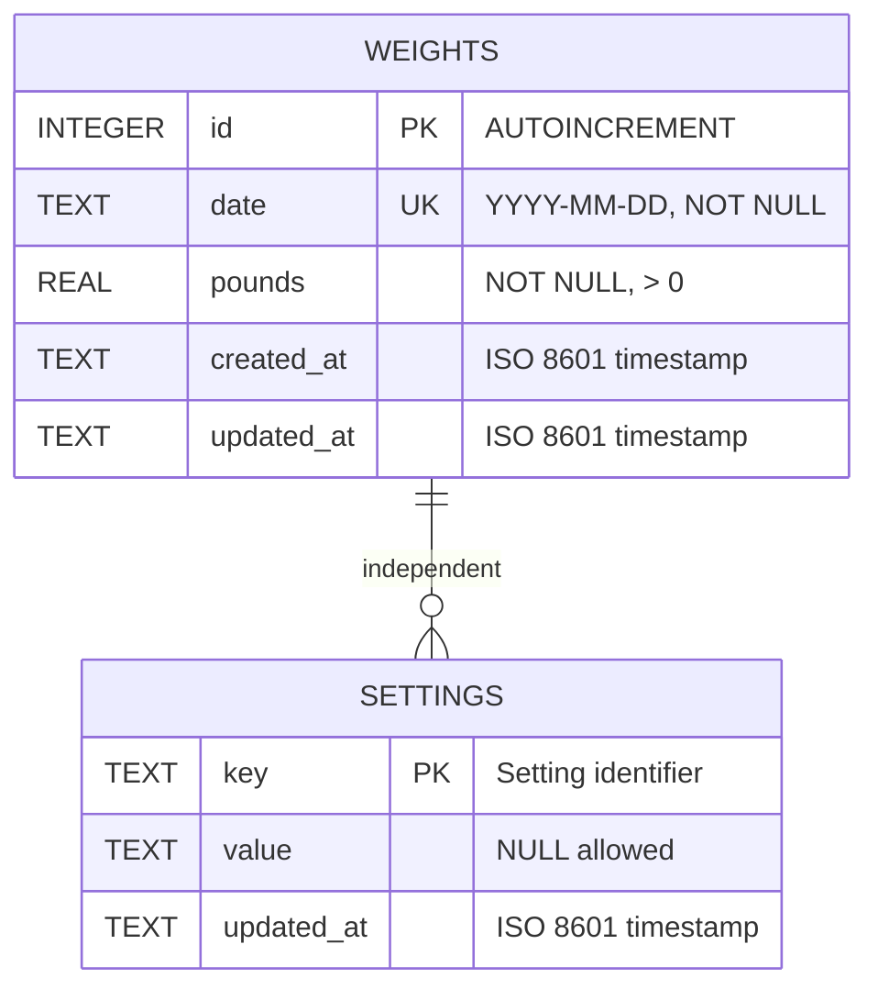
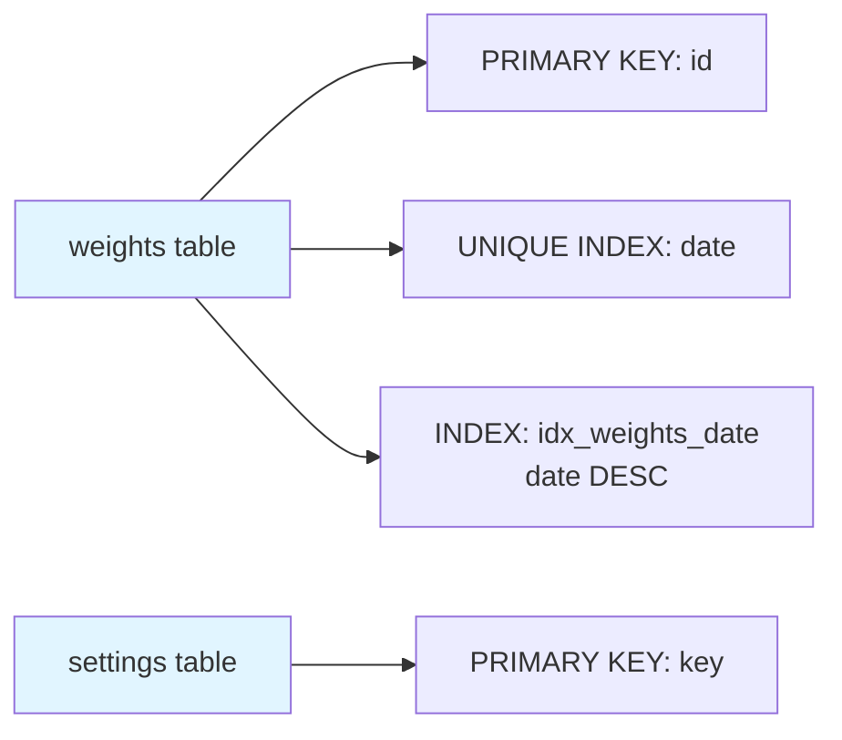
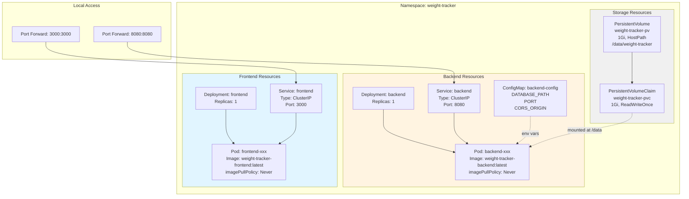
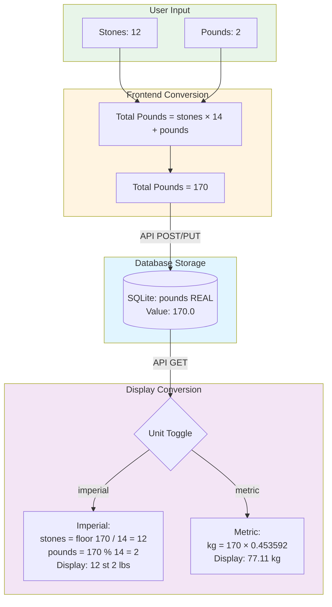
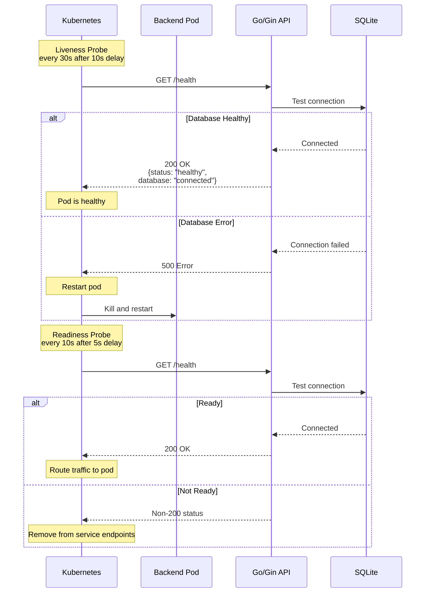

# Weight Tracker - Architecture Diagrams

## System Architecture



## Component Interaction Flow

### Weight Entry Creation Flow



### Goal Weight Management Flow



### Chart Filtering Flow



## Database Schema



### Database Indexes



## Kubernetes Resource Architecture



## Data Conversion Flow



## API Request/Response Flow

```mermaid
graph LR
    subgraph Client["Frontend Client"]
        A[fetch API]
    end

    subgraph CORS["CORS Middleware"]
        B[Check Origin<br/>http://localhost:3000]
    end

    subgraph Router["Gin Router"]
        C[/api/v1/weights]
        D[/api/v1/weights/:id]
        E[/api/v1/goal]
        F[/health]
    end

    subgraph Handlers["Request Handlers"]
        G[Validate Input]
        H[Database Query]
        I[Format Response]
    end

    subgraph Database["SQLite"]
        J[(weight-tracker.db)]
    end

    A --> B
    B --> C
    B --> D
    B --> E
    B --> F
    C --> G
    D --> G
    E --> G
    G --> H
    H --> J
    J --> I
    I --> A

    style Client fill:#e1f5ff
    style CORS fill:#fff4e1
    style Router fill:#f0f0f0
    style Handlers fill:#e8f5e9
    style Database fill:#f3e5f5
```

## Deployment Workflow

```mermaid
graph TB
    A[Start Minikube] --> B[eval $(minikube docker-env)]
    B --> C[Build Backend Image<br/>docker build -t weight-tracker-backend:latest]
    B --> D[Build Frontend Image<br/>docker build -t weight-tracker-frontend:latest]

    C --> E[kubectl apply -f k8s/namespace.yaml]
    D --> E

    E --> F[kubectl apply -f k8s/storage/]
    F --> G[kubectl apply -f k8s/backend/]
    G --> H[kubectl apply -f k8s/frontend/]

    H --> I{Pods Ready?}
    I -->|No| J[Wait for readiness probes]
    J --> I
    I -->|Yes| K[kubectl port-forward svc/frontend 3000:3000]
    I -->|Yes| L[kubectl port-forward svc/backend 8080:8080]

    K --> M[Access http://localhost:3000]
    L --> M

    style A fill:#e8f5e9
    style B fill:#fff4e1
    style C fill:#e1f5ff
    style D fill:#e1f5ff
    style M fill:#c8e6c9
```

## Health Check Flow


